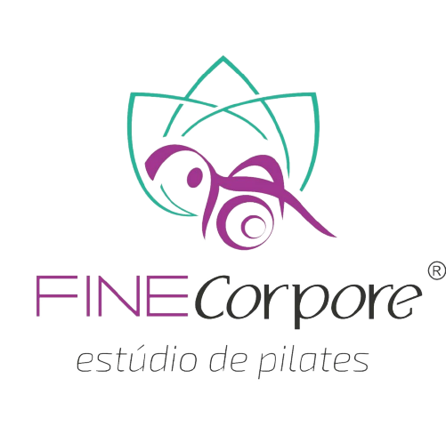

# Finecorpore Pilates

O **Finecorpore Pilates** é um estúdio moderno e sofisticado dedicado ao equilíbrio, bem-estar e saúde através do movimento consciente. Localizado no bairro Buritis em Belo Horizonte, o estúdio oferece um ambiente acolhedor e aulas personalizadas sob a supervisão de profissionais qualificados.

## 🚀 Funcionalidades

- **Carrossel de Imagens Dinâmico**: Apresentação visual atraente do ambiente e atividades.
- **Design Responsivo**: Experiência otimizada para dispositivos móveis, tablets e desktops.
- **Navegação Suave (Smooth Scroll)**: Facilidade de navegação entre as seções do site.
- **Integração com WhatsApp**: Botão flutuante e chamadas para ação (CTAs) diretas para agendamento.
- **Seções Informativas**:
  - **Sobre**: Filosofia e abordagem do estúdio.
  - **Equipe**: Detalhes sobre a formação e expertise do Dr. Raphael Henrique.
  - **Serviços**: Descrição das modalidades oferecidas (Pilates Aparelhos, Solo, Reabilitação, Postura).
  - **Depoimentos**: Feedback real de alunos.
  - **Contato**: Informações de localização, e-mail e redes sociais.

## 🛠️ Tecnologias Utilizadas

- **HTML5**: Estrutura semântica e SEO.
- **CSS3**: Estilização moderna com animações (Scroll Reveal).
- **JavaScript (Vanilla)**: Lógica do carrossel, efeitos de scroll e interatividade.
- **Google Fonts**: Tipografias *Inter* e *Outfit*.
- **Font Awesome**: Conjunto de ícones vetoriais.

## 👨‍⚕️ Profissional Responsável

**Dr. Raphael Henrique Dias Marques**
*Fisioterapeuta | CREFITO 202.649-F*
Especialista em Pilates Clínico e Preventivo, com mais de 15 anos de experiência em reabilitação e movimento consciente.

## 📍 Localização e Contato

- **Endereço**: Avenida Professor Mario Werneck, 2160, sala 2, Buritis, Belo Horizonte - MG.
- **WhatsApp**: (31) 98758-7015
- **E-mail**: finecorpore@gmail.com
- **Redes Sociais**:
  - [Instagram](https://www.instagram.com/finecorporepilates/)
  - [Facebook](https://www.facebook.com/people/Finecorpore-Pilates/100090907945968/)

---
Desenvolvido com foco na excelência e cuidado com o paciente.
